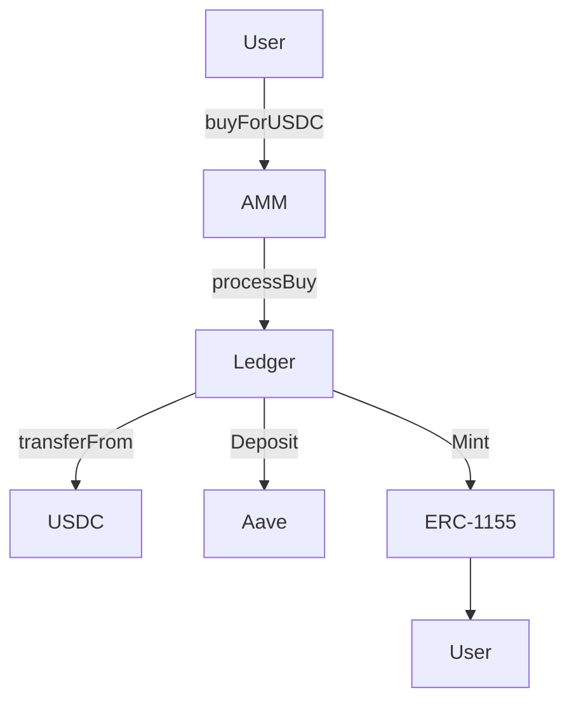

# Token Purchase Flow


## Overview




## 1. Front-End Flow

- User gets a quote for tokens from the AMM.
- User signs a Permit2 approval for USDC.
- User calls buy transaction on AMM.

### Quote (Trader → AMM)
Trader requests a quote from AMM for tokens_out for a given USDC_in.

```solidity
amm.quoteBuyForUSDC(
    marketId, 
    positionId, 
    isBack, 
    usdcIn, 
    0
) returns (uint256 tOut)
```

### Sign Permit
Trader signs an EIP‑712 **Permit2** `PermitSingle` with:

```
token = USDC
amount = usdcIn
spender = Ledger
sigDeadline / nonce = tightly scoped
```

### Execute on AMM (Trader → AMM)
Trader submits the trade with the Permit2 payload.

```solidity
amm.buyForUSDC(
  marketId, 
  positionId, 
  isBack,
  usdcIn, 
  0,            // tMax (unused)
  minTokensOut, // slippage guard
  true,         // usePermit2
  permitBlob    // abi.encode(PermitSingle, signature)
)
```

Flow continues to the AMM.

## 2. AMM Flow

- AMM Approves the trade.
- AMM updates internal state.
- AMM calls processBuy on the Ledger.

### Entry Point: User Calls `buyForUSDC` (User → LMSR)
User invokes the `buyForUSDC` function on the `LMSRMarketMaker` contract, providing exact USDC input and expecting tokens out (with slippage protection via `minTokensOut`).

```solidity
buyForUSDC(
    uint256 marketId,
    uint256 ledgerPositionId,
    bool isBack,
    uint256 usdcIn,
    uint256 tMax,             // unused (ABI compatibility)
    uint256 minTokensOut,
    bool usePermit2,
    bytes calldata permitBlob
)
```

### Initialization and Listing Check (LMSR Internal)
Verify the market is initialized and the position is listed in the LMSR (retrieve LMSR slot).

```solidity
require(self.initialized[marketId], "not initialized");
uint256 slot = LMSRHelpersLib.requireListed(
    self, 
    marketId, 
    ledgerPositionId
)
```

### Pre-Trade TWAP Update (LMSR Internal)
Accrue time-weighted average price (TWAP) using pre-trade prices for the affected slot.

```solidity
LMSRTwapO1Lib.updateBeforePriceChange(
    self, 
    marketId, 
    slot)
```

### Quote Tokens Out (LMSR Internal)
Compute exact tokens out (`tOut`) for the given USDC in using closed-form quote (fee stripped internally).

```solidity
tOut = LMSRQuoteLib.quoteBuyForUSDCInternal(
    self, 
    marketId, 
    ledgerPositionId, 
    isBack, 
    usdcIn);
```

### Slippage Check (LMSR Internal)
Ensure computed tokens out meet the minimum threshold and are positive.

```solidity
require(
    tOut >= minTokensOut && tOut > 0, 
    "slippage"
)
```

### Execute on Ledger (LMSR → Ledger)
LMSR forwards trade params + `permitBlob` to the Ledger for fund movement, accounting, and minting.

```solidity
self.ledger.processBuy(
    msg.sender, 
    marketId, 
    self.mmId,
    ledgerPositionId, 
    isBack, 
    usdcIn, 
    tOut, 
    0,
    usePermit2, 
    permitBlob
)
```

Flow continues in the Ledger.

### Apply State Update (LMSR Internal)
O(1) update to LMSR state (`G`, `R[slot]`, `S`) based on the trade (BACK/LAY, buy direction).

```solidity
LMSRUpdateLib.applyUpdateInternal(
    self, 
    marketId, 
    slot, 
    isBack, 
    true, 
    tOut)
```

### Post-Trade TWAP Update (LMSR Internal)
Baseline TWAP after the price change for the affected slot.

```solidity
LMSRTwapO1Lib.updateAfterPriceChange(
    self, 
    marketId, 
    slot)
```

### Emit Events (LMSR Internal)
Emit trade and price update events.

```solidity
emit LMSRMarketMaker.Trade(msg.sender, ledgerPositionId, isBack, tOut, usdcIn, true);
emit LMSRMarketMaker.PriceUpdated(
    ledgerPositionId,
    LMSRViewLib.getBackPriceWadInternal(self, marketId, ledgerPositionId)
);
```

## 3. Ledger Flow

- Ledger pulls USDC from user with Permit2.
- Deposits USDC to Aave.
- Applies Fees.
- Updates Accounting.
- Tells ERC1155 Contract to mint to user.

### Entry Point: AMM Calls on `processBuy` on Ledger (AMM → Ledger)
AMM forwards trade params + `permitBlob` to the Ledger for fund movement and accounting.

```solidity
ledger.processBuy(
    address to,
    uint256 marketId,
    uint256 mmId,
    uint256 positionId,
    bool isBack,
    uint256 usdcIn,
    uint256 tokensOut,
    uint256 minUSDCDeposited,
    bool usePermit2,
    bytes calldata permitBlob
)
```

### Pull Funds (Ledger → USDC)
Ledger validates the permit and **pulls USDC**.

```solidity
IPermit2(s.permit2).permitTransferFrom(
    permit2Calldata, 
    trader, 
    address(this), 
    amount)
```

### Deposit to Aave (Ledger → Aave)
Ledger supplies USDC to Aave, receiving interest‑bearing tokens.

```solidity
aavePool.supply(
    address(s.usdc), 
    amount, 
    address(this), 
    0
)
```

### Apply Protocol Fee (Ledger Internal)
Skim fee from the received aTokens **before** crediting collateral.

```solidity
skimOnAaveSupply(aReceived);
```

### Credit collateral (Ledger Internal)
Credit collateral to the marketmaker.

```solidity
// Credit real collateral
s.freeCollateral[mmId] += recordedAmount;
s.totalFreeCollateral  += recordedAmount;
s.totalValueLocked     += recordedAmount;
```

### Adjust Ledger Balances (Ledger Internal)
Adjust balances based on.

```solidity
updateTilt(
    uint256 mmId,
    uint256 marketId, 
    uint256 positionId, 
    int128 delta // here this is -tOut
)
```

### Enforce solvency (Ledger Internal)

```solidity
ensureSolvency(
    uint256 mmId, 
    uint256 marketId
)
```

### Enforce Redeemability (Ledger Internal)
When synthetic credit (ISC) is in use, ensure **real** capital is sufficient against redeemable exposure.

```solidity
if (redeemable > 0 && s.USDCSpent[mmId][marketId] < redeemable) {
    uint256 diff = uint256(redeemable - s.USDCSpent[mmId][marketId]);
    AllocateCapitalLib.allocate(mmId, marketId, diff);
}
```

### Mint Instruction (Ledger → ERC‑1155)
Ledger authorizes mint of Back/Lay tokens to the trader.

```solidity
PositionToken1155.mint(
    address to,
    uint256 tokenId, 
    uint256 amount)
```

## 4. ERC-1155 Flow

- Mints tokens to user.

### ERC‑1155 Minting (Token Contract)
ERC‑1155 contract mints to the trader.

```solidity
_mint(
    trader, 
    tokenId, 
    tOut, 
    ""
)
```

