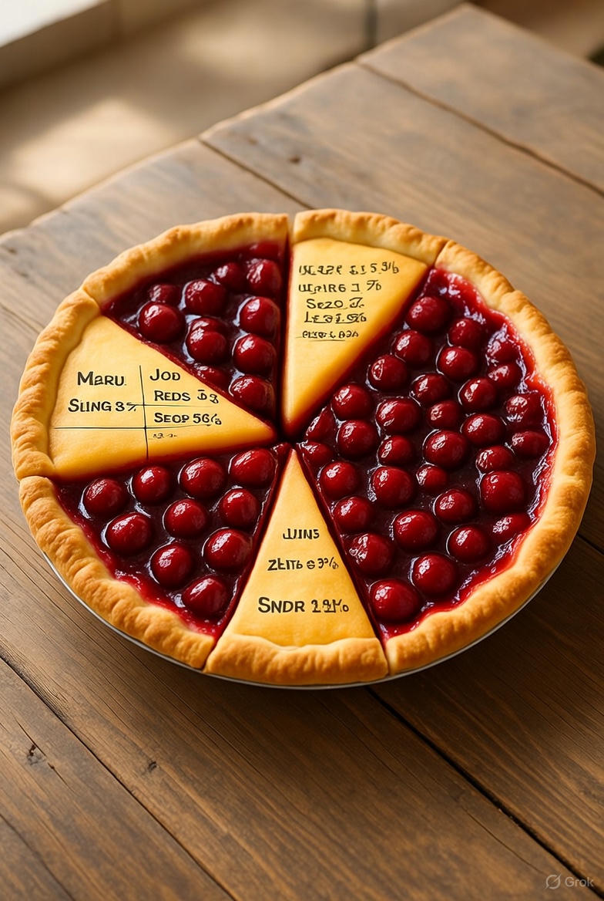

# PieMarket.fun

## Perpetual Prediction Pies

> **Get Your Slice of the Action!** 🍰

Each **pie** is a market, divided into tradable **slices** that always sum to \$1.  
Buying a slice increases its share of the pie, while other slices shrink proportionally.

---

## Crypto Influencer PIE

> Which X accounts are shaping the crypto world? 📈

- Each slice represents a different X account:
     - @VitalikButerin
     - @cz_binance
     - @APompliano
     - @aantonop
     - @cobie
     - etc...
- Take a buy slices to speculate on someone’s rising influence in crypto. 🚀  
- Sell your slices when you think their influence has peaked. 📉

---

## Visulisation and Branding

To represent varying slice sizes intuitively, we use a progressive visualization system based on percentage ranges. So its clear at a glance what percentage of the pie each position commands. The idea is that the branding will be attractive enough that peeople will be willing to share it and comment on it. These pictures just a brief mock up of some ideas, but will be designed with more taste!

---

### Full Pie (Percentages > 10%)

{width=400 style="border-radius: 8px; box-shadow: 0 2px 8px rgba(0,0,0,0.1);"}

---

### Slice Proportion (Percentages 1–10%)

{width=400 style="border-radius: 8px; box-shadow: 0 2px 8px rgba(0,0,0,0.1);"}

---

### Cherry Proportion (Percentages 0.1–1%)

{width=400 style="border-radius: 8px; box-shadow: 0 2px 8px rgba(0,0,0,0.1);"}

---

### Juice Drop Proportion (Percentages 0.01–0.1%)

{width=400 style="border-radius: 8px; box-shadow: 0 2px 8px rgba(0,0,0,0.1);"}

---

### Molecular Proportion (Percentages 0.001–0.01%)

{width=400 style="border-radius: 8px; box-shadow: 0 2px 8px rgba(0,0,0,0.1);"}
