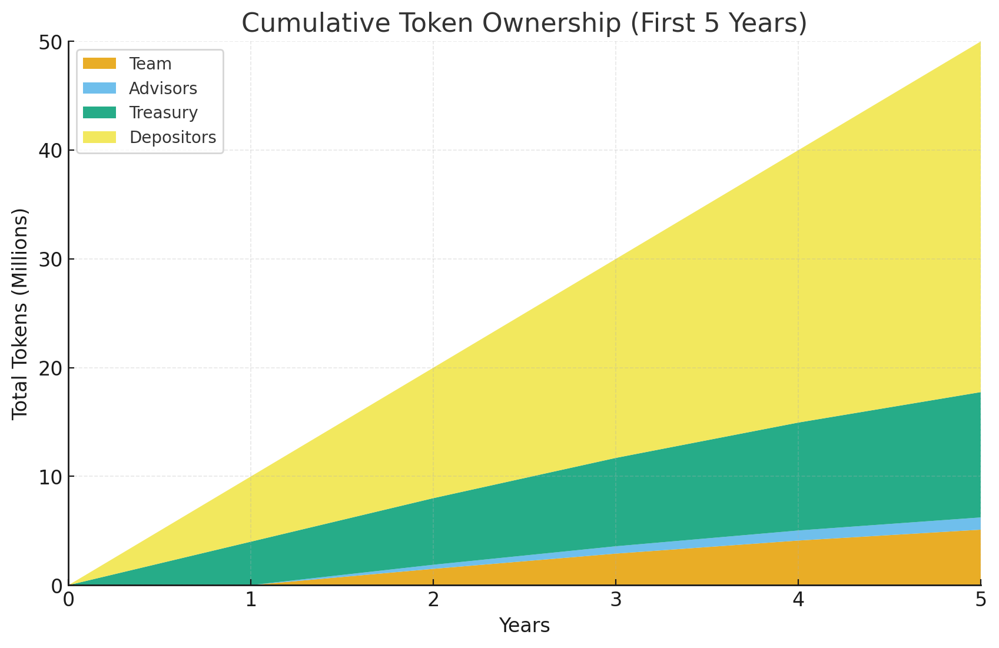

# Governance Tokenomics Plan

## Ideology & Rationale
Simple, fair, deflationary token distribution.

Fixed annual emissions ensure scarcity as protocol value (Total Value Locked / revenue) grows.

### Deflationary Mechanism
- Fixed Emissions per year/block.
- Early years: high token share per dollar.
    - High Total emissions per $ TVL
- Later years: lower share per dollar.
    - Low Total emissions per $ TVL

### Rewarding Early Risk
- Team/advisors get 0 tokens in Year 1.
- Allocations start Year 2, end by Year 10.

### Depositor Ownership
- Depositors provide USDC for yield.
- Depositior token emissions share rises to 90% by Year 11.
- Fixed total emissions reward loyalty in downturns.

### Supply Discipline
- Fixed issuance cuts supply inflation over time.
- Revenue can be used for buybacks/burns to reduce supply.

### Governance Control
- Manages Treasury tokens/revenue for:
  - Staking
  - Liquidity
  - Buybacks
  - Development
  - Community initiatives

## Treasury Assets

### Principal
- USDC deposits deployed for yield (eg Aave) via governance.

### Revenue
- USDC yield from DeFi (e.g., Aave).
- Held initially, later allocated for liquidity, developtment, buybacks, burns, rewards.

### Governance Tokens
- Used for staking, liquidity, grants.
- Drops to 10% of emissions by Year 11.

### Governance Role
- Controls Treasury via on-chain proposals.

## Token Emissions
### Annual Issuance
- 10M tokens/year, uncapped.

### Total Supply
- linear increase
- eg 100M tokens after 10 years.
- eg 500M tokens after 50 years.

### Issuance Structure
- Linear issuance, ~1.9 tokens/block.

## Token Distribution

### Year 1: Startup Phase
- Team: 0% (0 tokens).
- Advisors: 0% (0 tokens).
- Treasury: 40% (4M tokens).
- Depositors: 60% (6M tokens).

### Year 2
- Team: 15% (1.5M tokens).
- Advisors: 3.75% (0.375M tokens).
- Treasury: 21% (2.1M tokens).
- Depositors: 60% (6M tokens).

### Year 10
- Team: 7% (0.7M tokens).
- Advisors: 0.5% (0.05M tokens).
- Treasury: 11% (1.1M tokens).
- Depositors: 81.5% (8.15M tokens).

### Years 11+: Depositor Dominance
- Team/Advisors: 0% (fully vested).
- Treasury: 10% (1M tokens/year).
- Depositors: 90% (9M tokens/year).

## Cumulative Token Distribution
### After 10 Years (100M tokens)
- Team: ~10% (10M).
- Advisors: ~2.5% (2.5M).
- Treasury: ~16.9% (16.9M).
- Depositors: ~70.6% (70.6M).

### After 20 Years (200M tokens)
- Team: ~5% (10M).
- Advisors: ~1.25% (2.5M).
- Treasury: ~12.45% (24.9M).
- Depositors: ~81.3% (162.6M).

### Note
- Linear growth reduces insider share; depositors dominate.

## Governance Token Staking
### Funding
- Funded by Treasury emittance.

### Governance Role
- Adjusts rewards.

## Governance Responsibilities
### Manages Treasury

 - Spends or invests yield
  - Distributes treasury emittance
  - Controls Protocol levers

## Why It Works
- Predictable 10M/year issuance.
- Depositor focused rewards (reaching 90% of emissions) - growing TVL.
- Deflationary token issuance.
- Team advisor rewards capped
- Team and advisor rewards distributed from year 2-9. - Shared goals
- Token holders control Governance.

## Summary
### Token Supply
- 10M/year
- So 200M after 20 years for example

### Insider Cap
- Total 12.5M tokens
ie
- 0% after 1 year
- 12.5% after 10 years
- 6.25% after 20 years.
- 3.125 after 40 years

### Treasury Assets
- Revenue held early, later allocated; principal yields; tokens drop to 10%.

### Governance
- Ensures depositor dominance, flexible strategy.

