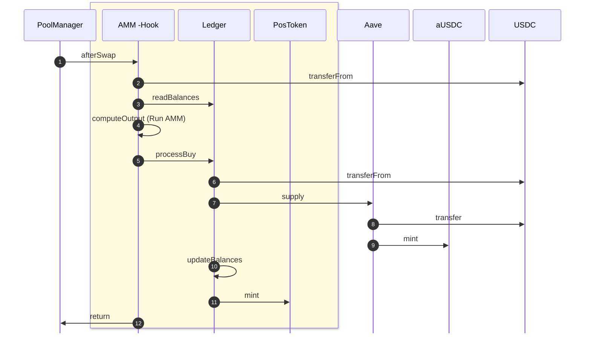
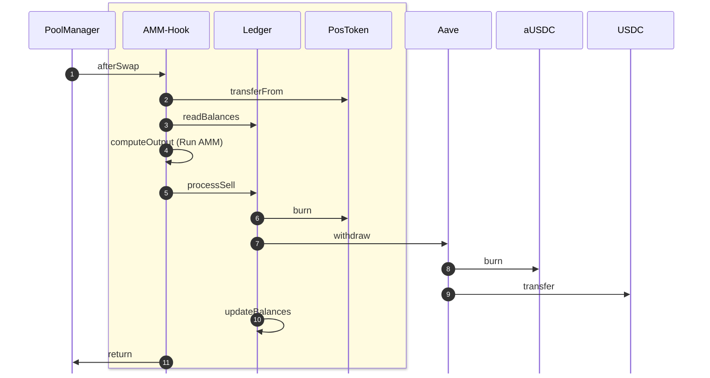

## Function Shapes

The following are the key function signatures involved in the buy and sell flows and liquidity transfer:

```solidity
// Hook ← PoolManager (afterSwap entry, Uniswap V4 standard)
function afterSwap(
  address to,
  PoolKey calldata poolKey,
  SwapParams calldata swapParams,
  int256 delta,
  bytes calldata hookData
) external returns (bytes4, int256);

// Hook → Ledger (processes buy flow: USDC to Aave, compute delta, mint tokens)
function processBuy(
  address to,
  uint256 marketId,
  uint256 AMMId,
  uint256 tokenId,
  uint256 usdcIn,
  uint256 tokensOut
) external;

// Hook → Ledger (processes sell flow: burn tokens, withdraw USDC from Aave)
function processSell(
  address to,
  uint256 marketId,
  uint256 AMMId,
  uint256 tokenId,
  uint256 tokensIn,
  uint256 usdcOut
) external;

// Hook (transfer liquidity ownership, called by owner)
function transferLiquidity(
  uint256 marketId,
  address newAddress,
) external;


//Ledger - Read Balances
fucntion readBalances(
  uint256 marketId
  uint256 AMMId
) view

// Ledger → PositionToken (mint tokens for buy flow)
function mint(
  address to,
  uint256 marketId,
  uint266 AMMId,
  uint256 tokenId,
  uint256 amount
) external;

// Ledger → PositionToken (burn tokens for sell flow)
function burn(
  address from,
  uint256 marketId,
  uint256 AMMId,
  uint256 tokenId,
  uint256 amount
) external;

// Ledger (update liquidity ownership, called by Hook)
function transferLiquidity(
  address newAddress,
  uint256 marketId,
  uint256 AMMId,
) external;

// Ledger (internal, consolidates delta computation and state updates)
function updateBalances(

) internal;

// --- Types ---
struct PoolKey {
  address token0;
  address token1;
  uint24 fee;
  int24 tickSpacing;
  address hooks;
}

struct SwapParams {
  bool zeroForOne;
  int256 amountSpecified;
  uint160 sqrtPriceLimitX96;
}
```


### Buy Flow (USDC → Token)

1. **PoolManager → Hook**: `afterSwap(to, poolKey, swapParams, delta, hookData)`
2. **Hook → USDC**: `transferFrom(PoolManager, Hook, usdcIn)` 
3. **Hook → Ledger**: `readBalances(marketId, AMMId)` 
4. **Hook (internal)**: `computeOutput` 
5. **Ledger → USDC**: `transferFrom(Hook, Ledger, usdcIn)`
6. **Hook → Ledger**: `processBuy(to, marketId, AMMId, tokenId, usdcIn, tokensOut)` 
7. **Ledger → AavePool**: `supply(USDC, usdcIn, onBehalfOf = Ledger)` 
8. **AavePool → USDC**: `transferFrom(Ledger, Aave, usdcIn)`
9. **AavePool → aUSDC**: `mint(Ledger, minted)`
10. **Ledger (internal)**: `updateBalances()` 
11. **Ledger → PositionToken**: `mint(to, marketId, AMMId, tokenId, tokensOut)` 
12. **Hook → PoolManager**: `return (selector, delta)`

## Sell Flow (Token → USDC)

1. **PoolManager → Hook**: `afterSwap(to, poolKey, swapParams, delta, hookData)` 
2. **Hook → PositionToken**: `transferFrom(PoolManager, Hook, tokensIn)` 
3. **Hook → Ledger**: `readBalances(marketId, AMMId)` 
4. **Hook (internal)**: `computeOutput`
5. **Hook → Ledger**: `processSell(to, marketId, AMMId, tokenId, tokensIn, usdcOut)`
6. **Ledger → PositionToken**: `burn(Hook, marketId, AMMId, tokenId, tokensIn)` 
7. **Ledger → AavePool**: `withdraw(USDC, usdcOut, to)` 
8. **AavePool → aUSDC**: `burn(Ledger, usdcOut)` 
9. **AavePool → USDC**: `transfer(to, usdcOut)`
10. **Ledger (internal)**: `updateBalances()` 
11. **Hook → PoolManager**: `return (selector, delta)`


## Liquidity Transfer

1. **Hook Owner → Hook**: `transferLiquidity(newAddress, marketId, tokenId)`
2. **Hook → Ledger**: `transferLiquidity(newAddress, marketId, tokenId)`
3. **Ledger (internal)**: Update liquidity ownership from Hook to `newAddress` for `(marketId, tokenId)`

## Sequence Diagram - Buy Flow (USDC → Token)



## Sequence Diagram - Sell Flow (Token → USDC)



#