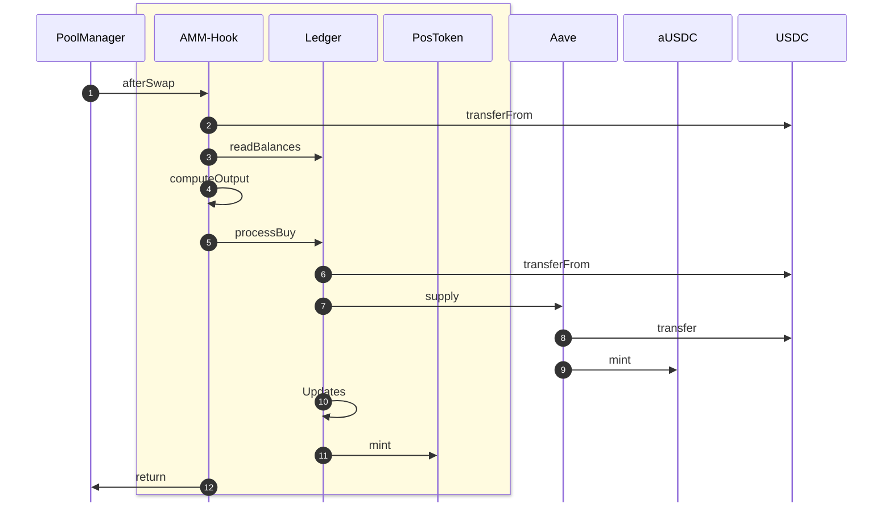
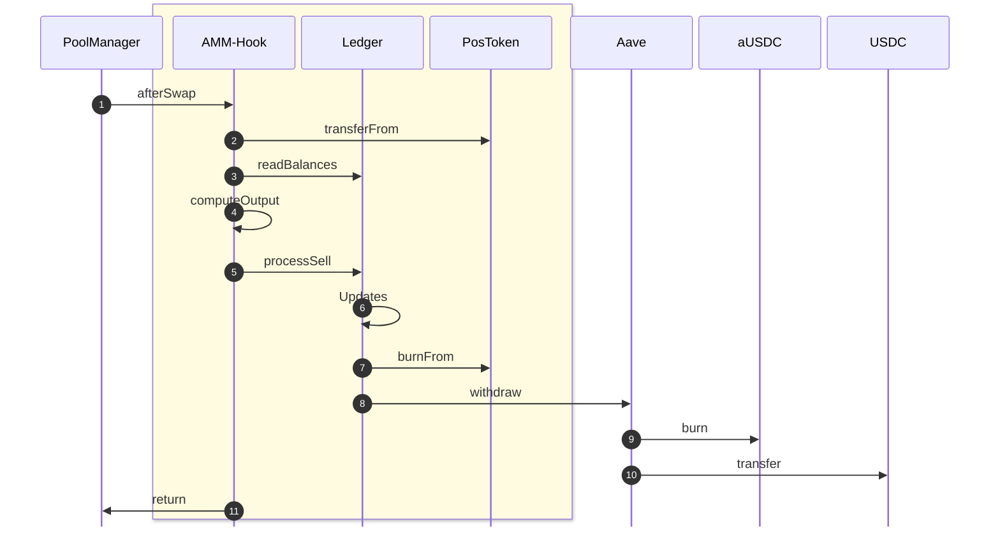

## Buy Flow (USDC → Token)

1. **PoolManager → Hook**: `afterSwap(to, poolKey, swapParams, delta, hookData)`
2. **Hook → USDC**: `transferFrom(PoolManager, Hook, usdcIn)` 
3. **Hook → Ledger**: `readBalances(marketId, mmId)`
4. **Hook (internal)**: `computeOutput`
5. **Hook → Ledger**: `processBuy(to, marketId, mmId, positionId, isBack, usdcIn, tokensOut, minUSDCDeposited)`
6. **Ledger → USDC**: `transferFrom(Hook, Ledger, usdcIn)` 
7. **Ledger → AavePool**: `supply(USDC, usdcIn, onBehalfOf = Ledger)` 
8. **AavePool → USDC**: `transferFrom(Ledger, Aave, usdcIn)` 
9. **AavePool → aUSDC**: `mint(Ledger, recordedUSDC)` 
10. **Ledger (internal)**: Updates
11. **Ledger → PositionToken**: `mint(to, tokensOut)`
12. **Hook → PoolManager**: `return (selector, delta)`

**Note**: If `usdcIn = 0`, steps 6–10 are skipped, allowing token minting without USDC deposit.

## Sell Flow (Token → USDC)

1. **PoolManager → Hook**: `afterSwap(to, poolKey, swapParams, delta, hookData)`
2. **Hook → PositionToken**: `transferFrom(PoolManager, Hook, tokensIn)`
3. **Hook → Ledger**: `readBalances(marketId, mmId)`
4. **Hook (internal)**: `computeOutput`
5. **Hook → Ledger**: `processSell(to, marketId, mmId, positionId, isBack, tokensIn, usdcOut)`
6. **Ledger (internal)**: Updates
7. **Ledger → PositionToken**: `burnFrom(Hook, tokensIn)`
8. **Ledger → AavePool**: `withdraw(USDC, usdcOut, to)` 
9. **AavePool → aUSDC**: `burn(Ledger, usdcOut)` 
10. **AavePool → USDC**: `transfer(to, usdcOut)` 
11. **Hook → PoolManager**: `return (selector, delta)`

**Note**: If `usdcOut = 0`, steps 8–10 are skipped, allowing token burning without USDC withdrawal.

## Liquidity Transfer

1. **Hook Owner/MM → Hook**: `transferLiquidity(mmId, newAddress)`
2. **Hook → Ledger**: `transferLiquidity(mmId, newAddress)`
3. **Ledger (internal)**: Update `mmIdToAddress[mmId]` to `newAddress`

## Sequence Diagram - Buy Flow (USDC → Token)

## Sequence Diagram - Sell Flow (Token → USDC)

