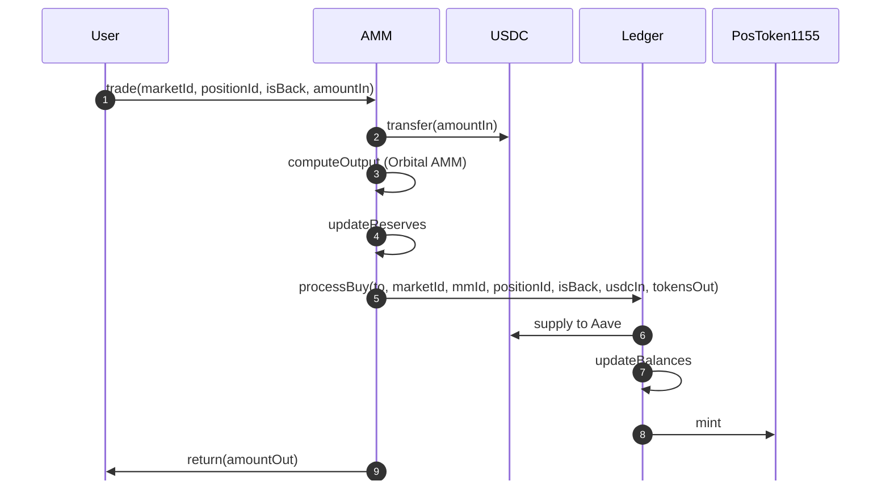

# Orbital AMM for Multi-Outcome Prediction Market

## Introduction

This document outlines the use of the Orbital Automated Market Maker (AMM) [Paradigm, 2025] for a multi-outcome prediction market with a simplified system consisting of three components: User, AMM, and Ledger. The Orbital AMM manages a single liquidity pool for \( n \) outcome positions, each with back and lay ERC1155 tokens, with probabilities driven by trading activity (lower reserves increase price/probability). The AMM is computationally efficient, solving a quadratic equation instead of LMSR’s exponentials, and integrates with the provided `MarketMakerLedger.sol` for token minting and liquidity tracking.

The system:
- Allows users to buy \( t \) tokens (back or lay) for a position (identified by `marketId`, `positionId`) with \( m \) USDC via the AMM.
- Updates reserves: \( x_i \to x_i + m \) for all outcomes, \( x_j \to x_j + m - t \) for the bought token.
- Uses O(1) updates for reserve sums, leveraging variance-like optimizations.
- Integrates with `MarketMakerLedger.sol` for ERC1155 token minting and Aave USDC deposits.
- Is adaptable to system changes (e.g., invariant or reserve rule modifications).

This document provides the mathematical foundation, quoting calculations, and implementation guidance for integrating the Orbital AMM, designed as a reference for finalizing the system.

## System Overview

- **User**: Initiates trades by calling the AMM’s `trade` function with \( m \) USDC to buy \( t \) back or lay tokens for a position in a market.
- **AMM**: Manages the pool with the Orbital invariant:

  $$
  \sum_{i=1}^n (r - x_i)^2 = r^2
  $$

  Computes prices, trade outputs, and updates reserves (\( x_i \), \( \sum x_i \), \( \sum x_i^2 \), radius \( r \)). Calls the Ledger’s `processBuy` for token minting.
- **Ledger** (`MarketMakerLedger.sol`): Mints ERC1155 position tokens (via `IPositionToken1155`), tracks market maker (MM) liquidity (`freeCollateral`, `allocatedCapital`, `tilt`), and supplies USDC to Aave.

### Sequence Diagram



## Mathematical Foundation

### Invariant

The Orbital AMM uses the spherical invariant:

$$
\sum_{i=1}^n (r - x_i)^2 = r^2
$$

- \( x_i \): Reserve of token \( i \) (back or lay for a position, in tokens, scaled by 1e18).
- \( r \): Radius (e.g., 1000e18).
- For each position, back and lay tokens are tracked separately (e.g., \( x_{j,\text{back}} \), \( x_{j,\text{lay}} \)), so \( n \) is the total number of tokens (e.g., 2 per position if back/lay).

### Price (Probability)

The price of token \( j \) (back or lay, in USDC, implying probability) is:

$$
p_j = \frac{r - x_j}{\sum_{k=1}^n (r - x_k)}
$$

- Lower \( x_j \) increases \( p_j \).
- Probabilities sum to 1:

  $$
  \sum p_j = \sum \frac{r - x_j}{\sum (r - x_k)} = 1
  $$

- Compute:

  $$
  \sum (r - x_k) = n r - \sum x_k
  $$

  using stored \( \sum x_k \).

### Reserve Update Rule

For buying \( t \) tokens of \( j \) (back or lay) with \( m \) USDC:
- For all \( i = 1, \dots, n \):

  $$
  x_i \to x_i + m
  $$

- For the bought token \( j \):

  $$
  x_j \to x_j + m - t
  $$

- Total reserves:

  $$
  \sum x_i' = \sum x_i + n m - t
  $$

### Sum Updates

To ensure O(1) computation, store \( \sum x_i \), \( \sum x_i^2 \):

- Post-trade:

  $$
  \sum x_i' = \sum x_i + n m - t
  $$

  $$
  \sum x_i'^2 = \sum x_i^2 + n m^2 - 2t x_j + 2m \sum x_i - 2m t + t^2
  $$

- Derivation:

  $$
  \sum x_i'^2 = (x_j + m - t)^2 + \sum_{i \neq j} (x_i + m)^2
  $$

  $$
  = (x_j^2 + 2m x_j - 2t x_j + m^2 - 2m t + t^2) + \sum_{i \neq j} (x_i^2 + 2m x_i + m^2)
  $$

  $$
  = \sum x_i^2 + 2m \sum x_i - 2t x_j + n m^2 - 2m t + t^2
  $$

### Invariant Post-Trade

The post-trade invariant is:

$$
(r - (x_j + m - t))^2 + \sum_{i \neq j} (r - (x_i + m))^2 = r^2
$$

## Quoting Calculations

### 1. Cost \( m \) for Desired Quantity \( t \)

Solve for \( m \) given \( t \) tokens of \( j \):

$$
n m^2 - 2m \left( t + (n r - \sum x_i) \right) + t^2 + 2t (r - x_j) = 0
$$

- Coefficients:
  - \( a = n \)
  - \( b = -2 (t + n r - \sum x_i) \)
  - \( c = t^2 + 2t (r - x_j) \)

- Solution:

  $$
  m = \frac{-b \pm \sqrt{b^2 - 4ac}}{2a}
  $$

  Choose the smaller positive root.

- Approximation (for small \( t \)):

  $$
  m \approx t \cdot \frac{r - x_j}{\sum (r - x_k)} = t \cdot p_j
  $$

### 2. Quantity \( t \) for Given Cost \( m \)

Solve for \( t \) given \( m \) USDC:

$$
t^2 + 2t (r - x_j - m) + \left( n m^2 - 2m (n r - \sum x_i) \right) = 0
$$

- Coefficients:
  - \( a = 1 \)
  - \( b = 2 (r - x_j - m) \)
  - \( c = n m^2 - 2m (n r - \sum x_i) \)

- Solution:

  $$
  t = \frac{-b \pm \sqrt{b^2 - 4ac}}{2a}
  $$

  Choose the positive root ensuring \( t \leq r - x_j \).

- Approximation:

  $$
  t \approx m \cdot \frac{\sum (r - x_k)}{r - x_j} = \frac{m}{p_j}
  $$

## Implementation

### Smart Contracts

#### AMM.sol

Manages the pool, computes trades, and integrates with `MarketMakerLedger.sol`.

```solidity
// SPDX-License-Identifier: MIT
pragma solidity ^0.8.24;

import {IERC20} from "@openzeppelin/contracts/token/ERC20/IERC20.sol";
import {PRBMathUD60x18} from "prb-math/PRBMathUD60x18.sol";
import {MarketMakerLedger} from "./MarketMakerLedger.sol";

contract AMM {
    using PRBMathUD60x18 for uint256;

    struct Token {
        uint256 marketId;
        uint256 positionId;
        bool isBack;
    }

    address[] public outcomeTokens; // Encoded as marketId, positionId, isBack
    mapping(address => Token) public tokenDetails; // token -> details
    address public collateralToken; // USDC
    address public ledger; // MarketMakerLedger
    uint256 public radius; // Orbital radius
    mapping(address => uint256) public reserves; // x_i per token
    uint256 public sumReserves; // sum x_i
    uint256 public sumSquaredReserves; // sum x_i^2
    uint256 public mmId; // Market maker ID for Ledger

    constructor(address _collateralToken, address _ledger, uint256 _radius, uint256 _mmId) {
        collateralToken = _collateralToken;
        ledger = _ledger;
        radius = _radius;
        mmId = _mmId;
    }

    function addOutcome(uint256 marketId, uint256 positionId, bool isBack) external {
        address token = encodeToken(marketId, positionId, isBack);
        outcomeTokens.push(token);
        tokenDetails[token] = Token(marketId, positionId, isBack);
        reserves[token] = 1e18; // Initialize reserve
        sumReserves += 1e18;
        sumSquaredReserves += 1e36;
    }

    function encodeToken(uint256 marketId, uint256 positionId, bool isBack) internal pure returns (address) {
        return address(uint160((marketId << 128) | (positionId << 64) | (isBack ? 1 : 0)));
    }

    function calculateOutput(uint256 marketId, uint256 positionId, bool isBack, uint256 amountIn) public view returns (uint256 amountOut, uint256 probability) {
        address tokenOut = encodeToken(marketId, positionId, isBack);
        uint256 xOut = reserves[tokenOut];
        uint256 sumRx = outcomeTokens.length * radius - sumReserves;
        probability = (radius - xOut) * 1e18 / sumRx;
        uint256 n = outcomeTokens.length;
        uint256 a = 1;
        uint256 b = 2 * (radius - xOut - amountIn);
        uint256 c = n * amountIn * amountIn - 2 * amountIn * sumRx;
        uint256 discriminant = b * b - 4 * a * c;
        amountOut = (0 - b + discriminant.sqrt()) / (2 * a);
        return (amountOut, probability);
    }

    function calculateCost(uint256 marketId, uint256 positionId, bool isBack, uint256 desiredOut) public view returns (uint256 amountIn, uint256 probability) {
        address tokenOut = encodeToken(marketId, positionId, isBack);
        uint256 xOut = reserves[tokenOut];
        uint256 sumRx = outcomeTokens.length * radius - sumReserves;
        probability = (radius - xOut) * 1e18 / sumRx;
        uint256 n = outcomeTokens.length;
        uint256 a = n;
        uint256 b = 2 * (desiredOut + sumRx);
        uint256 c = desiredOut * desiredOut + 2 * desiredOut * (radius - xOut);
        uint256 discriminant = b * b - 4 * a * c;
        amountIn = (b - discriminant.sqrt()) / (2 * a);
        return (amountIn, probability);
    }

    function trade(uint256 marketId, uint256 positionId, bool isBack, uint256 amountIn) external returns (uint256 amountOut) {
        require(IERC20(collateralToken).transferFrom(msg.sender, address(this), amountIn), "Transfer failed");
        address tokenOut = encodeToken(marketId, positionId, isBack);
        (amountOut, ) = calculateOutput(marketId, positionId, isBack, amountIn);
        uint256 n = outcomeTokens.length;
        int256 deltaSum = int256(amountIn * n - amountOut);
        uint256 x_j = reserves[tokenOut];
        int256 deltaSumSquared = int256(
            n * amountIn * amountIn -
            2 * amountOut * x_j +
            2 * amountIn * sumReserves -
            2 * amountIn * amountOut +
            amountOut * amountOut
        );
        for (uint256 i = 0; i < n; i++) {
            reserves[outcomeTokens[i]] += amountIn;
        }
        reserves[tokenOut] -= amountOut;
        sumReserves = uint256(int256(sumReserves) + deltaSum);
        sumSquaredReserves = uint256(int256(sumSquaredReserves) + deltaSumSquared);
        MarketMakerLedger(ledger).processBuy(msg.sender, marketId, mmId, positionId, isBack, amountIn, amountOut, 0);
        return amountOut;
    }
}
```

### Front-End Integration

Use ethers.js for quoting and trading:

```javascript
const { ethers } = require("ethers");

async function quoteQuantity(ammAddress, marketId, positionId, isBack, amountIn, provider) {
    const amm = new ethers.Contract(ammAddress, [
        "function calculateOutput(uint256 marketId, uint256 positionId, bool isBack, uint256 amountIn) view returns (uint256 amountOut, uint256 probability)"
    ], provider);
    const [amountOut, probability] = await amm.calculateOutput(marketId, positionId, isBack, amountIn);
    return { amountOut: amountOut.toString(), probability: probability.toString() };
}

async function quoteCost(ammAddress, marketId, positionId, isBack, desiredOut, provider) {
    const amm = new ethers.Contract(ammAddress, [
        "function calculateCost(uint256 marketId, uint256 positionId, bool isBack, uint256 desiredOut) view returns (uint256 amountIn, uint256 probability)"
    ], provider);
    const [amountIn, probability] = await amm.calculateCost(marketId, positionId, isBack, desiredOut);
    return { amountIn: amountIn.toString(), probability: probability.toString() };
}

async function trade(ammAddress, marketId, positionId, isBack, amountIn, signer) {
    const amm = new ethers.Contract(ammAddress, [
        "function trade(uint256 marketId, uint256 positionId, bool isBack, uint256 amountIn) external returns (uint256 amountOut)"
    ], signer);
    const tx = await amm.trade(marketId, positionId, isBack, amountIn);
    const receipt = await tx.wait();
    return receipt;
}
```

### Deployment

1. **Install Foundry**:

   ```bash
   curl -L https://foundry.paradigm.xyz | bash && foundryup
   ```

2. **Create Project**:

   ```bash
   forge init prediction-market && cd prediction-market
   forge install openzeppelin/openzeppelin-contracts prb/math
   ```

3. **Deploy**:

   ```solidity
   // script/DeployAMM.s.sol
   // SPDX-License-Identifier: MIT
   pragma solidity ^0.8.24;
   import {Script} from "forge-std/Script.sol";
   import {AMM} from "../src/AMM.sol";
   import {MarketMakerLedger} from "../src/MarketMakerLedger.sol";

   contract DeployAMM is Script {
       function run() external {
           vm.startBroadcast();
           MarketMakerLedger ledger = new MarketMakerLedger(
               0xYourUSDC,
               0xYourAUSDC,
               0xYourAavePool,
               0xYourPositionToken1155
           );
           AMM amm = new AMM(0xYourUSDC, address(ledger), 1000e18, 1); // mmId=1
           amm.addOutcome(1, 1, true); // marketId=1, positionId=1, isBack
           vm.stopBroadcast();
       }
   }
   ```

   ```bash
   forge script script/DeployAMM.s.sol --rpc-url https://rpc.sepolia.org --private-key <your-key> --verify --verifier sourcify --broadcast
   ```

### Testing

Test in `test/AMMTest.t.sol`:

```solidity
// SPDX-License-Identifier: MIT
pragma solidity ^0.8.24;

import {Test} from "forge-std/Test.sol";
import {AMM} from "../src/AMM.sol";
import {MarketMakerLedger} from "../src/MarketMakerLedger.sol";
import {IERC20} from "@openzeppelin/contracts/token/ERC20/IERC20.sol";

contract AMMTest is Test {
    AMM amm;
    MarketMakerLedger ledger;
    address usdc = address(0xUSDC);
    uint256 marketId = 1;
    uint256 positionId = 1;
    bool isBack = true;

    function setUp() public {
        ledger = new MarketMakerLedger(usdc, address(0xAUSDC), address(0xAavePool), address(0xPositionToken1155));
        amm = new AMM(usdc, address(ledger), 1000e18, 1);
        amm.addOutcome(marketId, positionId, isBack);
    }

    function testTrade() public {
        uint256 amountIn = 100e6; // 100 USDC
        uint256 r = amm.radius();
        address tokenA = amm.encodeToken(marketId, positionId, isBack);
        uint256 xA = amm.reserves(tokenA);
        uint256 sumX = amm.sumReserves();
        uint256 sumX2 = amm.sumSquaredReserves();
        uint256 n = amm.outcomeTokens().length;
        vm.prank(msg.sender);
        uint256 amountOut = amm.trade(marketId, positionId, isBack, amountIn);
        uint256 newXA = amm.reserves(tokenA);
        uint256 newSumX = amm.sumReserves();
        uint256 newSumX2 = amm.sumSquaredReserves();
        uint256 expectedDeltaSum = amountIn * n - amountOut;
        uint256 expectedDeltaSum2 = n * amountIn * amountIn - 2 * amountOut * xA + 2 * amountIn * sumX - 2 * amountIn * amountOut + amountOut * amountOut;
        assertEq(newSumX, sumX + expectedDeltaSum, "Sum reserves mismatch");
        assertEq(newSumX2, sumX2 + expectedDeltaSum2, "Sum squared reserves mismatch");
        assertLt(newXA, xA + amountIn, "Reserve A should reflect m - t");
    }
}
```

## Notes for Future Integration

- **System Changes**: Update the quadratic coefficients in `calculateOutput`/`calculateCost` if the reserve rule or invariant changes. The AMM’s sum storage is flexible.
- **Ticks**: Add Orbital ticks (spherical caps with plane constant \( k \)) for concentrated liquidity, using the torus invariant.
- **Ledger Integration**: The AMM calls `processBuy`, which handles Aave supply and ERC1155 token minting. Ensure `IPositionToken1155` is deployed.
- **Security**: Audit the AMM for reentrancy and precision errors (e.g., via OpenZeppelin).
- **Front-End**: Extend JS quoting for multiple markets/positions, fetching reserves from AMM.

This document provides a foundation for integrating the Orbital AMM with your Ledger, adaptable to system evolution.