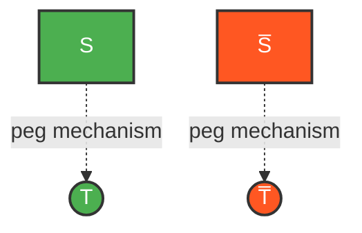
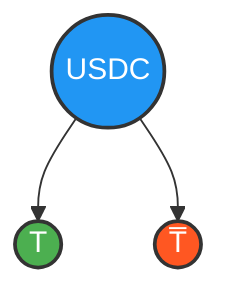
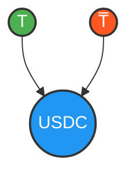

## Tokenizing Principals

### Tokens \( T \) and \( \overline{T} \)

### Constant Price Formula
To preserve the complementary dynamics inherent in \( S \) and \( \overline{S} \), we fix the prices of our tokens to a constant.

\[ P_T + P_{\overline{T}} = 1 \]

### Price Units

The constant price formula can be tied to any asset as needed. We envision this system primarily being priced in stablecoins, such as USDT or USDC. In this paper, we use USDC as shorthand for the pricing asset of choice.

### Enforcement of Constant Price Formula

The constant price relationship is enforced by allowing 1 \( T \) and 1 \( \overline{T} \) to be minted or burned at any time for 1 USDC.

    

  

  

