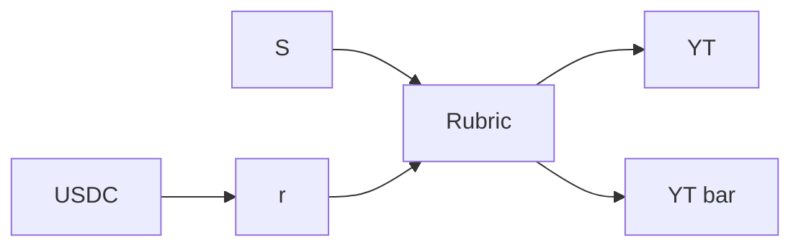

## Peg Mechanism: Linking Tokens to Performance

The peg mechanism ties the value of token $T$ to the expected future performance of an underlying phenomenon $S$. Below are the key variables:

- $r$: Daily USDC yield
- $YT$: Yield for token $T$
- $Y\overline{T}$: Yield for token $\overline{T}$

Each $T$ and $\overline{T}$ pair is minted with USDC. USDC is deposited into an interest-bearing protocol generating a daily yield $r$. This yield is split between $YT$ and $Y\overline{T}$ based on $S$, as evaluated by a fixed market rubric, such that:

$$
YT + Y\overline{T} = r
$$

## What Does Price Mean?

- $P(T)$: Present value of token $T$’s future yields ($YT$).
- $P(\overline{T})$: Present value of token $\overline{T}$’s yields ($Y\overline{T}$).

i.e.:

$$
P(T) = \sum_{t=1}^{\infty} \frac{YT_t}{(1 + r_t)^t}
$$

$$
P(\overline{T}) = \sum_{t=1}^{\infty} \frac{Y\overline{T}_t}{(1 + r_t)^t}
$$

## Rubrics

**Definitions**:

- $\rho_T$: Ratio of $r$ received by $T$.
- $\rho_{\bar{T}}$: Ratio of $r$ received by $\bar{T}$.

Thus:

- $Y_T = r \cdot \rho_T$
- $Y_{\bar{T}} = r \cdot \rho_{\bar{T}}$

The constraint for the function is:

- Ratios must sum to 1:
  - $\rho_T(S) + \rho_{\bar{T}}(S) = 1$

**Properties**:

There are infinitely many pairs of $\rho_T$ and $\rho_{\bar{T}}$ functions that satisfy the rubric conditions. We anticipate the most widely used will be the linear mapping:
  
  - $\rho_T(S) = \frac{S}{S_{max}}$
  - $\rho_{\bar{T}}(S) = 1 - \frac{S}{S_{max}}$

## Yield Distribution

The peg is maintained through daily yield distributions from the USDC yield $r$, as described earlier. The yields are allocated to $T$ and $\overline{T}$ holders based on the performance of $S$ relative to the maximum possible performance $S_{max}$, using the linear mapping defined in the rubric:

$$
Y_T = r \cdot \frac{S}{S_{max}}, \quad Y_{\overline{T}} = r \cdot \frac{S_{max} - S}{S_{max}}
$$

This ensures the total daily yield is fully distributed:

$$
Y_T + Y_{\overline{T}} = r
$$

The better $S$ performs, the larger the share of the daily yield $T$ holders receive, and vice versa for $\overline{T}$.

